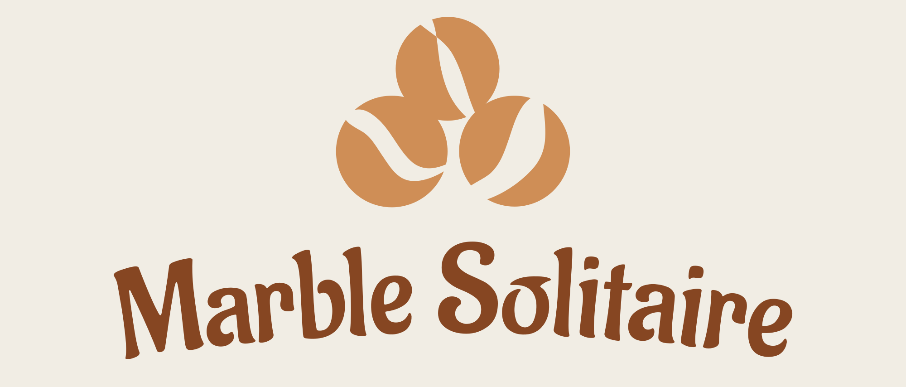

<br/>

<div align="center">
  <a href="LICENSE">
    
  </a>
  <a href="https://isocpp.org/">
    
  </a>
  <a href="https://www.opengl.org/">
    
  </a>
  <a href="http://glew.sourceforge.net/">
    
  </a>
  <a href="https://www.glfw.org/">
    
  </a>
  <a href="https://github.com/SpartanJ/SOIL2">
    
  </a>
  <a href="https://www.ambiera.com/irrklang/">
    
  </a>
  <a href="https://github.com/g-truc/glm">
    
  </a>
  <a href="https://www.microsoft.com/windows">
    
  </a>
</div>

<br/>

<p align="center">
    <b>A C++/OpenGL recreation of the classic Marble Solitaire board game, built as part of a Computer Graphics with C++ coursework.</b>
</p>

<br/>

# 📋 Table of Contents

- [YouTube Demo](#-youtube-demo)
- [About](#-about)  
- [Features](#️-features)  
- [Limitations](#-limitations)  
- [Tech Stack](#️-tech-stack)  
- [Installation](#-installation)  
- [How to Play](#-how-to-play)  
- [Contributing](#-contributing)  
- [License](#-license)  

<br/>

# 🎥 YouTube Demo

[](https://youtu.be/XikcYObMmg0)

# 🔎 About

Marble Solitaire challenges you to clear the board down to a single marble by “jumping” marbles over one another and removing the jumped marble.

- Start with the board filled except for one empty hole in the center.  
- Click a marble, then click an adjacent empty spot two spaces away to jump and remove the in-between marble.  
- Keep playing until no moves remain or you’ve won by leaving just one marble.  

This project showcases:

- 🎨 **Custom 3D assets** — board and marbles modeled in Blender  
- 🔊 **Audio design** — sound effects & background music via irrKlang  
- 💻 **Core OpenGL coursework concepts**  
  - 📐 Geometric primitives & transformations  
  - 🎥 Projection, view matrices & camera  
  - 💡 Lighting & shading  
  - 🖥️ GLSL vertex/fragment shaders  

<br/>

# ⚙️ Features

- ✔️ 3D board & marbles rendered with modern OpenGL
- 🔧 **Code-level board layout selection** — choose a preset (e.g. “plus”, “cross”, “diamond”) by passing it to `GameController::newGame()` in your source before building (not a runtime option) 
- 🔄 **Rotate board** by holding the right mouse button and dragging 
- 🧱 Self-modeled Blender assets for a polished look  
- 🎶 Background music and jump sound effects  

<br/>

# 🚫 Limitations

- ❌ No scoring system or move/time tracking  
- ❌ Winning marble may end anywhere (should be center)  
- ❌ No undo, hint, or “solve from here” assistance  
- ❌ No choice of board configuration as part of the gameplay 

<br/>

# 🛠️ Tech Stack

- **Language:** C++  
- **Graphics:** OpenGL, GLEW, GLFW, GLM, SOIL2  
- **Audio:** irrKlang  
- **Modeling:** Blender (.obj assets)  
- **Build:** Visual Studio solution (`.sln`)  

<br/>

# 🚀 Installation

1. Clone the repository
    ```bash
    git clone --recurse-submodules https://github.com/patrykkuta/marble-solitaire.git
    cd marble-solitaire
    git submodule update --init --recursive
    ```
2. Open **MarbleSolitaire.sln** in Visual Studio  
3. Build & Run  

<br/>

# 🎮 How to Play

1. Press **Space** to start the game  
2. Click a marble, then click an empty spot two spaces away to jump  
3. Continue until you clear all but one marble or no moves remain  

💡 **Tip**: Hold the right mouse button and drag to rotate the board view.  

<br/>

# 🤝 Contributing

1. Fork the repo  
2. Clone your fork
    ```bash
   git clone <your-fork-url>
   cd marble-solitaire
3.	Create a feature branch
4.	Commit your changes & push
5.	Open a Pull Request

<br/>

# 📄 License

This project is released under the **MIT License**. See LICENSE for details.